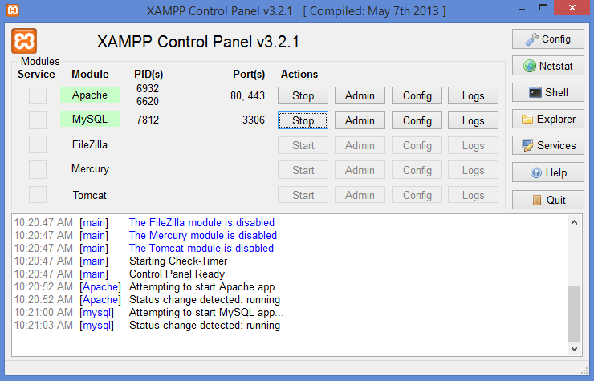

#### March 16, 2017

## 0. Introduction
The advent of [R notebooks](https://blog.rstudio.org/2016/10/05/r-notebooks/) in October 2016 allow us to analyze data in the popular notebook format, similarly to iPython. Using R notebooks, we can not only embed R code, but also Python and SQL code as well.

## 1. Loading the data

The [Lahman database](http://www.seanlahman.com/baseball-archive/statistics/) compiles baseball statistics from the 1870's until the present. I downloaded the 2016 version and set up a MySQL server using [XAMPP](https://en.wikipedia.org/wiki/XAMPP). After you install it, fire up the XAMPP Control Panel and start the Apache and MySQL modules.


<br>

The Lahman database is ~65 MB, so I had to change some of the settings in the php.ini file to allow for larger files to be uploaded to the server. To make the changes, click on the Config button on the Apache module row and select php.ini

The [RMySQL](https://cran.r-project.org/web/packages/RMySQL/RMySQL.pdf) R package allows us to query a MySQL database by creating something called a connection to the database.

Herein we load the RMySQL package, connect to the database, and list the tables in it:

```{r, echo=TRUE}
library(RMySQL)
drv <- dbDriver("MySQL")
db <- dbConnect(drv, user="root", dbname = "lahman2016", host="127.0.0.1")
dbListTables(db)
```

The Lahman database has 4 main tables. The MASTER table contains players' natural information like date and city of birth as well as physical characteristics, such as height and weight. The Batting, Pitching, and Fielding tables carry players' statistics relevant to those skills.

## 2. Raw SQL queries: The 1980 Major League Baseball season
### 2.1 1981 Topps baseball cards
On my childhood Saturdays in Puerto Rico, my father would go to a bakery store and buy hot "criollo" bread for everyone, and a couple of [Topps](https://www.topps.com/) baseball packs for me. The packs cost somewhere in the vicinity of 10 or 15 cents and they included a stick of gum, too. Gee whiz!


A [general strike](https://en.wikipedia.org/wiki/1981_Major_League_Baseball_strike) notwithstanding, baseball was a **big** deal in 1981, and the baseball world at the time was buzzing with [Fernandomania](http://sabr.org/research/fernandomania), the spectacular rise to prominence of a [Los Angeles Dodgers](http://losangeles.dodgers.mlb.com/) pitcher from Sonora named [Fernando "El Toro" Valenzuela](http://m.mlb.com/player/123619/fernando-valenzuela). That year, Valenzuela would go on to win both the Rookie of the Year and Cy Young awards in the National League, and [beat the mighty Yankees in the World Series in front of 56,000 faithful at Dodger Stadium](http://www.espn.com/los-angeles/mlb/columns/story?id=5325436). In our neck of the woods, we also paid a lot of attention to the exploits of one [José "Cheo" Cruz](http://www.astrosdaily.com/files/team/cruz/cruz.html), Puerto Rico's most distinguished baseball player in the early eighties.


The 1981 Topps cards had all the players' statistics up to 1980, so I was pretty well acquainted with MLB's top performers in 1980. Let's query the Lahman database on player's performances in 1980.

### 2.2 1980 home run and batting average leaders
The 1980 home run leaders can be found by querying the Batting table and specifying the year with a `WHERE` clause. We can also sort the results with `ORDER BY` and limit the number of results returned by the query with `LIMIT`. `SELECT` lets us specify which columns of the resulting table to return.
```{r, eval=FALSE, include=TRUE}
SELECT yearID, playerID, teamID, hr
FROM Batting
WHERE yearID = 1980
ORDER BY HR DESC
LIMIT 10
```

```{sql connection=db}
SELECT yearID, playerID, teamID, hr
FROM Batting
WHERE yearID = 1980
ORDER BY HR DESC
LIMIT 10
```

Note that the results returned are for the whole MLB, and are not segmented by league like we are used to. Also, the Batting table only has the player and team codes, rather than their names. 

We can also perform a very similar query, this time making use of a formula, to obtain the top ten batting averages in 1980. We filter the results to only include players with at least 400 AB's
```{r, eval=FALSE, include=TRUE}
SELECT yearID AS year, playerID, teamID, H AS Hits, AB AS At_Bats, (H/AB) AS Batting_Average
FROM Batting
WHERE yearID = 1980 AND AB > 400
ORDER BY Batting_Average DESC
LIMIT 10
```

```{sql connection=db}
SELECT yearID AS year, playerID, teamID, H AS Hits, AB AS At_Bats, (H/AB) AS Batting_Average
FROM Batting
WHERE yearID = 1980 AND AB > 400
ORDER BY Batting_Average DESC
LIMIT 10
```


### 2.3 Using `JOIN`s
#### 2.3.1 Home runs and batting average
To obtain the player names in the home run example, we have to cross-reference the playerID's of the resulting table with the MASTER table using a `JOIN` statement. The `JOIN` statement performs an [inner join](https://www.w3schools.com/sql/sql_join_inner.asp) between the Batting and MASTER tables `ON` playerID to find the player's name. Here we do it for home runs:
```{r, eval=FALSE, include=TRUE}
SELECT yearID, CONCAT(nameFirst, " ", nameLast) AS fullName, teamID, hr
FROM Batting
JOIN MASTER
ON Batting.playerID = MASTER.playerID
WHERE yearID = 1980
ORDER BY HR DESC
LIMIT 10
```

```{sql connection=db}
SELECT yearID, CONCAT(nameFirst, " ", nameLast) AS fullName, teamID, hr
FROM Batting
JOIN MASTER
ON Batting.playerID = MASTER.playerID
WHERE yearID = 1980
ORDER BY HR DESC
LIMIT 10
```

In addition, to find the teams' names, `JOIN` the table we just got with the Teams table, `ON` the teamID field. We will take the last query in its entirety, alias its resulting table as "hrtop10", and `JOIN` it with Teams `ON` teamID.
```{r, eval=FALSE, include=TRUE}
SELECT hrtop10.yearID, hrtop10.fullName, Teams.name as teamName, hrtop10.hr
FROM (SELECT yearID, CONCAT(nameFirst, " ", nameLast) AS fullName, teamID, hr
      FROM Batting
      JOIN MASTER
      ON Batting.playerID = MASTER.playerID
      WHERE yearID = 1980
      ORDER BY HR DESC
      LIMIT 10) hrtop10 /*table alias*/
JOIN Teams 
ON hrtop10.teamID = Teams.teamID AND hrtop10.yearID = Teams.yearID
WHERE hrtop10.yearID = 1980
ORDER BY hrtop10.hr DESC
```

```{sql connection=db}
SELECT hrtop10.yearID, hrtop10.fullName, Teams.name as teamName, hrtop10.hr
FROM (SELECT yearID, CONCAT(nameFirst, " ", nameLast) AS fullName, teamID, hr
      FROM Batting
      JOIN MASTER
      ON Batting.playerID = MASTER.playerID
      WHERE yearID = 1980
      ORDER BY HR DESC
      LIMIT 10) hrtop10 /*table alias*/
JOIN Teams 
ON hrtop10.teamID = Teams.teamID AND hrtop10.yearID = Teams.yearID
WHERE hrtop10.yearID = 1980
ORDER BY hrtop10.hr DESC
```

There we go! Some memorable names in that list! [Mike Schmidt](http://baseballhall.org/hof/schmidt-mike), the Hall of Fame third baseman considered one of the best ever to play that position in history. Indeed, he was named MVP of the National League in 1980. His 48 HR's that year stood as a record for a third baseman until 2007. His Philadelphia Phillies would go on to win the World Series in 1980, and he was named MVP of the Series, too. Bob Horner, another third baseman slugger, who in 1986 [became the 11th player ever to hit four home runs in a single game](http://sabr.org/latest/foster-30-years-ago-bob-horner-hit-four-home-runs-and-braves-still-lost). Schmidt is a member of that [club](https://en.wikipedia.org/wiki/List_of_Major_League_Baseball_single-game_home_run_leaders), too. Of course, who can forget [Mr. October](http://baseballhall.org/hof/jackson-reggie), who [in the sixth game of the 1977 World Series hit 3 home runs with 3 swings](http://www.history.com/this-day-in-history/mr-october-hits-three-homers-in-three-swings).


We can do it for the 1980 batting average leaders table as well:
```{r, eval=FALSE, include=TRUE}
SELECT batop10.yearID AS year, batop10.fullName, Teams.name as teamName, batop10.H AS Hits, batop10.AB AS At_Bats, batop10.Batting_Average
FROM (SELECT yearID, CONCAT(nameFirst, " ", nameLast) AS fullName, teamID, H, AB, (H/AB) AS Batting_Average
      FROM Batting
      JOIN MASTER
      ON Batting.playerID = MASTER.playerID
      WHERE yearID = 1980 AND AB > 400
      ORDER BY Batting_Average DESC
      LIMIT 10) batop10 /*table alias*/
JOIN Teams 
ON batop10.teamID = Teams.teamID AND batop10.yearID = Teams.yearID
WHERE batop10.yearID = 1980
ORDER BY batop10.Batting_Average DESC
```

```{sql connection=db}
SELECT batop10.yearID AS year, batop10.fullName, Teams.name as teamName, batop10.H AS Hits, batop10.AB AS At_Bats, batop10.Batting_Average
FROM (SELECT yearID, CONCAT(nameFirst, " ", nameLast) AS fullName, teamID, H, AB, (H/AB) AS Batting_Average
      FROM Batting
      JOIN MASTER
      ON Batting.playerID = MASTER.playerID
      WHERE yearID = 1980 AND AB > 400
      ORDER BY Batting_Average DESC
      LIMIT 10) batop10 /*table alias*/
JOIN Teams 
ON batop10.teamID = Teams.teamID AND batop10.yearID = Teams.yearID
WHERE batop10.yearID = 1980
ORDER BY batop10.Batting_Average DESC
```

1980 also saw [George Brett](http://baseballhall.org/hof/brett-george), with a 0.390 batting average, come close to joining the [0.400 fraternity](http://www.baseball-almanac.com/hitting/hi400c.shtml), one that hasn't welcomed any new members since [1941](http://www.history.com/this-day-in-history/ted-williams-becomes-last-player-to-hit-400). Since 1941, only [Tony Gwynn](http://baseballhall.org/hof/gwynn-tony) has come closer than Brett to the 0.400 mark. I also have an indelible memory of George Brett [**furiously** storming the field](https://www.youtube.com/watch?v=gbEHAsZxRYo) during the [pine tar incident of 1983](https://en.wikipedia.org/wiki/Pine_Tar_Incident). His Kansas City Royals reached the World Series in 1980, where they lost to the Phillies.


#### 2.3.2 Hall of Fame inductees
Another query we can answer using a join: Which players active in 1980 went on to join Cooperstown's Hall of Fame? Since pitchers and batters are kept in separate tables, let's do the batters first. We can do a `JOIN` between a table of batters active in 1980 and a table of fielders whose position was not pitcher. We use the `DISTINCT` function for this second table because some players played more than one position in 1980 and they would therefore be reported more than once if we don't use `DISTINCT`. For example, Carlton Fisk played first base, third base, outfielder, and catcher in 1980.
```{r, eval=FALSE, include=TRUE}
SELECT batter1980.playerID
FROM  (SELECT playerID FROM Batting WHERE yearID = 1980) batter1980
JOIN (SELECT DISTINCT(playerID) FROM Fielding WHERE yearID = 1980 AND Pos <> "P") notPitcher1980
ON batter1980.playerID = notPitcher1980.playerID
```

```{sql connection=db}
SELECT batter1980.playerID
FROM  (SELECT playerID FROM Batting WHERE yearID = 1980) batter1980
JOIN (SELECT DISTINCT(playerID) FROM Fielding WHERE yearID = 1980 AND Pos <> "P") notPitcher1980
ON batter1980.playerID = notPitcher1980.playerID
```

Then we can take that table, alias it as batterNotPitcher1980 and `JOIN` it to the HallOfFame table, filtered to include inductees only, `ON` playerID. Additionally, before performing the `JOIN`, we can compute the percentage of voters received by the inductees from the sportswriters the year they were inducted. The threshold for induction is 75% of the votes.
```{r, eval=FALSE, include=TRUE}
SELECT batterNotPitcher1980.playerID, hof.Percentage_of_votes_received, hof.yearInducted
FROM (SELECT batter1980.playerID
      FROM  (SELECT playerID FROM Batting WHERE yearID = 1980) batter1980
      JOIN (SELECT DISTINCT(playerID) FROM Fielding WHERE yearID = 1980 AND Pos <> "P") notPitcher1980
      ON batter1980.playerID = notPitcher1980.playerID) batterNotPitcher1980
JOIN (SELECT 100.0*(votes/ballots) AS Percentage_of_votes_received, playerID, yearID AS yearInducted FROM HallOfFame WHERE inducted = "Y") hof
ON hof.playerID = batterNotPitcher1980.playerID
ORDER BY hof.Percentage_of_votes_received DESC
```

```{sql connection=db}
SELECT batterNotPitcher1980.playerID, hof.Percentage_of_votes_received, hof.yearInducted
FROM (SELECT batter1980.playerID
      FROM  (SELECT playerID FROM Batting WHERE yearID = 1980) batter1980
      JOIN (SELECT DISTINCT(playerID) FROM Fielding WHERE yearID = 1980 AND Pos <> "P") notPitcher1980
      ON batter1980.playerID = notPitcher1980.playerID) batterNotPitcher1980
JOIN (SELECT 100.0*(votes/ballots) AS Percentage_of_votes_received, playerID, yearID AS yearInducted FROM HallOfFame WHERE inducted = "Y") hof
ON hof.playerID = batterNotPitcher1980.playerID
ORDER BY hof.Percentage_of_votes_received DESC
```

Then we can `JOIN` the table we just got with the MASTER table to find the players' names, using the playerID like we did before. We are using `DISTINCT` because if a player played for more than one team in 1980, he will appear twice in the MASTER table, and in our results, which we don't want. On the pitchers side, Gaylord Perry played for two different teams in 1980.
```{r, eval=FALSE, include=TRUE}
SELECT DISTINCT(CONCAT(nameFirst, " ", nameLast)) AS fullName, hof1980Batting.Percentage_of_votes_received, hof1980Batting.yearInducted
FROM (SELECT batterNotPitcher1980.playerID, hof.Percentage_of_votes_received, hof.yearInducted
      FROM (SELECT batter1980.playerID
            FROM  (SELECT playerID FROM Batting WHERE yearID = 1980) batter1980
            JOIN (SELECT DISTINCT(playerID) FROM Fielding WHERE yearID = 1980 AND Pos <> "P") notPitcher1980
            ON batter1980.playerID = notPitcher1980.playerID) batterNotPitcher1980
      JOIN (SELECT 100.0*(votes/ballots) AS Percentage_of_votes_received, playerID, yearID AS yearInducted FROM HallOfFame WHERE inducted = "Y") hof
      ON hof.playerID = batterNotPitcher1980.playerID
      ORDER BY hof.Percentage_of_votes_received DESC) hof1980Batting
JOIN MASTER
ON hof1980Batting.playerID = MASTER.playerID
ORDER BY hof1980Batting.Percentage_of_votes_received DESC
```

```{sql connection=db}
SELECT DISTINCT(CONCAT(nameFirst, " ", nameLast)) AS fullName, hof1980Batting.Percentage_of_votes_received, hof1980Batting.yearInducted
FROM (SELECT batterNotPitcher1980.playerID, hof.Percentage_of_votes_received, hof.yearInducted
      FROM (SELECT batter1980.playerID
            FROM  (SELECT playerID FROM Batting WHERE yearID = 1980) batter1980
            JOIN (SELECT DISTINCT(playerID) FROM Fielding WHERE yearID = 1980 AND Pos <> "P") notPitcher1980
            ON batter1980.playerID = notPitcher1980.playerID) batterNotPitcher1980
      JOIN (SELECT 100.0*(votes/ballots) AS Percentage_of_votes_received, playerID, yearID AS yearInducted FROM HallOfFame WHERE inducted = "Y") hof
      ON hof.playerID = batterNotPitcher1980.playerID
      ORDER BY hof.Percentage_of_votes_received DESC) hof1980Batting
JOIN MASTER
ON hof1980Batting.playerID = MASTER.playerID
ORDER BY hof1980Batting.Percentage_of_votes_received DESC
```

[Tim Raines](http://baseballhall.org/hof/raines-tim)! He was not elected until **2017**, his last year of eligibility. Some have [suggested](https://fivethirtyeight.com/features/sabermetrics-helped-put-tim-raines-in-the-hall-of-fame/) that his induction may have been partly due to a more sophisticated understanding of sabermetrics. Good for him! [Rickey Henderson](http://baseballhall.org/hof/henderson-rickey)! No one is prouder of Rickey than Rickey, [the greatest](https://www.youtube.com/watch?v=XCRy_fK8fu8), of all time! I remember a catcher could **really** make a name for himself if he caught Rickey stealing. Rickey stole 100 bases in 1980, and 130 in 1982. I also remember the gracefulness of [Ozzie Smith ](http://baseballhall.org/hof/smith-ozzie), the Wizard of Oz.


Now we do it for the pitchers, in a single step:
```{r, eval=FALSE, include=TRUE}
SELECT DISTINCT(CONCAT(nameFirst, " ", nameLast)) AS fullName, hof1980Pitching.Percentage_of_votes_received, hof1980Pitching.yearInducted
FROM (SELECT pitcherNotBatter1980.playerID, hof.Percentage_of_votes_received, hof.yearInducted
      FROM (SELECT pitcher1980.playerID
            FROM  (SELECT playerID FROM Pitching WHERE yearID = 1980) pitcher1980
            JOIN (SELECT DISTINCT(playerID) FROM Fielding WHERE yearID = 1980 AND Pos = "P") onlyPitcher1980
            ON pitcher1980.playerID = onlyPitcher1980.playerID) pitcherNotBatter1980
      JOIN (SELECT 100.0*(votes/ballots) AS Percentage_of_votes_received, playerID, yearID AS yearInducted FROM HallOfFame WHERE inducted = "Y") hof
      ON hof.playerID = pitcherNotBatter1980.playerID
      ORDER BY hof.Percentage_of_votes_received DESC) hof1980Pitching
JOIN MASTER
ON hof1980Pitching.playerID = MASTER.playerID
ORDER BY hof1980Pitching.Percentage_of_votes_received DESC
```

```{sql connection=db}
SELECT DISTINCT(CONCAT(nameFirst, " ", nameLast)) AS fullName, hof1980Pitching.Percentage_of_votes_received, hof1980Pitching.yearInducted
FROM (SELECT pitcherNotBatter1980.playerID, hof.Percentage_of_votes_received, hof.yearInducted
      FROM (SELECT pitcher1980.playerID
            FROM  (SELECT playerID FROM Pitching WHERE yearID = 1980) pitcher1980
            JOIN (SELECT DISTINCT(playerID) FROM Fielding WHERE yearID = 1980 AND Pos = "P") onlyPitcher1980
            ON pitcher1980.playerID = onlyPitcher1980.playerID) pitcherNotBatter1980
      JOIN (SELECT 100.0*(votes/ballots) AS Percentage_of_votes_received, playerID, yearID AS yearInducted FROM HallOfFame WHERE inducted = "Y") hof
      ON hof.playerID = pitcherNotBatter1980.playerID
      ORDER BY hof.Percentage_of_votes_received DESC) hof1980Pitching
JOIN MASTER
ON hof1980Pitching.playerID = MASTER.playerID
ORDER BY hof1980Pitching.Percentage_of_votes_received DESC
```


[Tom Seaver](http://baseballhall.org/hof/seaver-tom) held the record for the highest voting percentage received from the sportswriters to enter the Hall of Fame until [Ken Griffey Jr.](http://baseballhall.org/hof/griffey-jr-ken) broke it in 2016. [Nolan Ryan](http://baseballhall.org/hof/ryan-nolan), who has at least three records that probably will never be topped: 5,714 career strikeouts, 7 career no-hitters, and 383 strikeouts in a single season, ranks third in percentage of votes received to Cooperstown, behind Seaver and Griffey. [Steve Carlton](http://baseballhall.org/hof/carlton-steve) won 2 games in the 1980 World Series playing for the Phillies, a Series they won. His 304 innings pitched in 1980 were [the last time anyone pitched 300 or more](http://www.espn.com/blog/sweetspot/post/_/id/12820/the-best-pitching-seasons-since-1960). He led the NL in wins (24), innings, and strikeouts (286) that year, and won the NL Cy Young award as well.


### 2.4 Using `GROUP BY`
#### 2.4.1 Top home run hitters by position in 1980
Suppose we want to know the top home run hitters by position in 1980, e.g., which first baseman hit more home runs than any other? We will do it by steps, as we built the earlier queries. We will first create a table by joining the Batting and Fielding tables for 1980
```{r, eval=FALSE, include=TRUE}
SELECT hr1980.playerID, hr1980.hr, pos1980.Pos
FROM (SELECT playerID, hr FROM Batting WHERE yearID = 1980) hr1980
JOIN (SELECT playerID, Pos FROM Fielding WHERE yearID = 1980 ) pos1980
ON hr1980.playerID = pos1980.playerID
```

```{sql connection=db}
SELECT hr1980.playerID, hr1980.hr, pos1980.Pos
FROM (SELECT playerID, hr FROM Batting WHERE yearID = 1980) hr1980
JOIN (SELECT playerID, Pos FROM Fielding WHERE yearID = 1980 ) pos1980
ON hr1980.playerID = pos1980.playerID
```


Then we create a table that outputs the maximum home runs by position, using `GROUP BY`.
```{r, eval=FALSE, include=TRUE}
SELECT MAX(hr1980.hr) as max_hr, pos1980.Pos
FROM (SELECT playerID, hr FROM Batting WHERE yearID = 1980) hr1980
JOIN (SELECT playerID, Pos FROM Fielding WHERE yearID = 1980 ) pos1980
ON hr1980.playerID = pos1980.playerID
GROUP BY pos1980.Pos
```

```{sql connection=db}
SELECT MAX(hr1980.hr) as max_hr, pos1980.Pos
FROM (SELECT playerID, hr FROM Batting WHERE yearID = 1980) hr1980
JOIN (SELECT playerID, Pos FROM Fielding WHERE yearID = 1980 ) pos1980
ON hr1980.playerID = pos1980.playerID
GROUP BY pos1980.Pos
```


There are seven fielding positions, so we just have the highest home run totals at each position. Then we take the two manufactured tables and `JOIN` them on two fields: player position and home runs. The first table will match the second only where home runs are highest, at each position.
```{r, eval=FALSE, include=TRUE}
SELECT playerID, posTable.hr as home_runs, posTable.Pos as Position
FROM (SELECT hr1980.playerID, hr1980.hr, pos1980.Pos
      FROM (SELECT playerID, hr FROM Batting WHERE yearID = 1980) hr1980
      JOIN (SELECT playerID, Pos FROM Fielding WHERE yearID = 1980 ) pos1980
      ON hr1980.playerID = pos1980.playerID) posTable
JOIN (SELECT MAX(hr1980.hr) as max_hr, pos1980.Pos
      FROM (SELECT playerID, hr FROM Batting WHERE yearID = 1980) hr1980
      JOIN (SELECT playerID, Pos FROM Fielding WHERE yearID = 1980 ) pos1980
      ON hr1980.playerID = pos1980.playerID
      GROUP BY pos1980.Pos) posTableMax
ON posTable.Pos = posTableMax.Pos AND posTable.hr = posTableMax.max_hr
```

```{sql connection=db}
SELECT playerID, posTable.hr as home_runs, posTable.Pos as Position
FROM (SELECT hr1980.playerID, hr1980.hr, pos1980.Pos
      FROM (SELECT playerID, hr FROM Batting WHERE yearID = 1980) hr1980
      JOIN (SELECT playerID, Pos FROM Fielding WHERE yearID = 1980 ) pos1980
      ON hr1980.playerID = pos1980.playerID) posTable
JOIN (SELECT MAX(hr1980.hr) as max_hr, pos1980.Pos
      FROM (SELECT playerID, hr FROM Batting WHERE yearID = 1980) hr1980
      JOIN (SELECT playerID, Pos FROM Fielding WHERE yearID = 1980 ) pos1980
      ON hr1980.playerID = pos1980.playerID
      GROUP BY pos1980.Pos) posTableMax
ON posTable.Pos = posTableMax.Pos AND posTable.hr = posTableMax.max_hr
```


Finally, we do the `JOIN` with the MASTER table to get the players' names:
```{r, eval=FALSE, include=TRUE}
SELECT DISTINCT(CONCAT(nameFirst, " ", nameLast)) AS fullName, home_runs, Position
FROM (SELECT playerID, posTable.hr as home_runs, posTable.Pos as Position
      FROM (SELECT hr1980.playerID, hr1980.hr, pos1980.Pos
            FROM (SELECT playerID, hr FROM Batting WHERE yearID = 1980) hr1980
            JOIN (SELECT playerID, Pos FROM Fielding WHERE yearID = 1980 ) pos1980
            ON hr1980.playerID = pos1980.playerID) posTable
      JOIN (SELECT MAX(hr1980.hr) as max_hr, pos1980.Pos
            FROM (SELECT playerID, hr FROM Batting WHERE yearID = 1980) hr1980
            JOIN (SELECT playerID, Pos FROM Fielding WHERE yearID = 1980 ) pos1980
            ON hr1980.playerID = pos1980.playerID
            GROUP BY pos1980.Pos) posTableMax
      ON posTable.Pos = posTableMax.Pos AND posTable.hr = posTableMax.max_hr) maxHrByPosition
JOIN MASTER
ON MASTER.playerID = maxHrByPosition.playerID
ORDER BY maxHrByPosition.home_runs DESC
```

```{sql connection=db}
SELECT DISTINCT(CONCAT(nameFirst, " ", nameLast)) AS fullName, home_runs, Position
FROM (SELECT playerID, posTable.hr as home_runs, posTable.Pos as Position
      FROM (SELECT hr1980.playerID, hr1980.hr, pos1980.Pos
            FROM (SELECT playerID, hr FROM Batting WHERE yearID = 1980) hr1980
            JOIN (SELECT playerID, Pos FROM Fielding WHERE yearID = 1980 ) pos1980
            ON hr1980.playerID = pos1980.playerID) posTable
      JOIN (SELECT MAX(hr1980.hr) as max_hr, pos1980.Pos
            FROM (SELECT playerID, hr FROM Batting WHERE yearID = 1980) hr1980
            JOIN (SELECT playerID, Pos FROM Fielding WHERE yearID = 1980 ) pos1980
            ON hr1980.playerID = pos1980.playerID
            GROUP BY pos1980.Pos) posTableMax
      ON posTable.Pos = posTableMax.Pos AND posTable.hr = posTableMax.max_hr) maxHrByPosition
JOIN MASTER
ON MASTER.playerID = maxHrByPosition.playerID
ORDER BY maxHrByPosition.home_runs DESC
```

Great! There was a tie at the outfielder position between Ben Oglivie and Reggie Jackson. We see beloved Hall of Famers [Gary Carter](http://baseballhall.org/hof/carter-gary) at catcher and [Robin Yount](http://baseballhall.org/hof/yount-robin) at shortstop. Carter was a key player of the New York Mets in 1986, when they won the World Series. Yount played his entire career with the Milwaukee Bucks. In 1982, he was named MVP of the American League after receiving [27 out of 28](http://www.baseball-reference.com/awards/awards_1982.shtml) first-place votes from the writers.

#### 2.4.2 Home run leaders of the eighties

We can find out the home run leaders by year throughout the eighties using the same `GROUP BY` construct. Start by finding the maximum number of home runs hit by year for each year of the decade.
```{r, eval=FALSE, include=TRUE}
SELECT MAX(hrEighties.hr) as max_hr, yearID
FROM (SELECT yearID, playerID, hr FROM Batting WHERE yearID > 1979 AND yearID < 1990) hrEighties
GROUP BY yearID
```

```{sql connection=db}
SELECT MAX(hrEighties.hr) as max_hr, yearID
FROM (SELECT yearID, playerID, hr FROM Batting WHERE yearID > 1979 AND yearID < 1990) hrEighties
GROUP BY yearID
```


Then create a table of home runs of every player that batted in the eighties.
```{r, eval=FALSE, include=TRUE}
SELECT yearID, playerID, teamID, hr FROM Batting WHERE yearID > 1979 AND yearID < 1990
```

```{sql connection=db}
SELECT yearID, playerID, teamID, hr FROM Batting WHERE yearID > 1979 AND yearID < 1990
```

Now `JOIN` the two tables `ON` home runs and year. We get more than 10 results because of the ties. In 1982, for example, Reggie Jackson and Gorman Thomas were tied for the lead with 39 home runs each.
```{r, eval=FALSE, include=TRUE}
SELECT hrEightiesTable.yearID as year, playerID, teamID, hrEightiesTable.hr
FROM (SELECT yearID, playerID, teamID, hr FROM Batting WHERE yearID > 1979 AND yearID < 1990) hrEightiesTable
JOIN (SELECT MAX(hrEighties.hr) as max_hr, yearID
      FROM (SELECT yearID, playerID, hr FROM Batting WHERE yearID > 1979 AND yearID < 1990) hrEighties
      GROUP BY yearID) hrEightiesTableMax
ON hrEightiesTable.yearID = hrEightiesTableMax.yearID AND hrEightiesTable.hr = hrEightiesTableMax.max_hr
```

```{sql connection=db}
SELECT hrEightiesTable.yearID as year, playerID, teamID, hrEightiesTable.hr
FROM (SELECT yearID, playerID, teamID, hr FROM Batting WHERE yearID > 1979 AND yearID < 1990) hrEightiesTable
JOIN (SELECT MAX(hrEighties.hr) as max_hr, yearID
      FROM (SELECT yearID, playerID, hr FROM Batting WHERE yearID > 1979 AND yearID < 1990) hrEighties
      GROUP BY yearID) hrEightiesTableMax
ON hrEightiesTable.yearID = hrEightiesTableMax.yearID AND hrEightiesTable.hr = hrEightiesTableMax.max_hr
```

What about categorizing them by leagues? We can do it by three small modifications to the previous query. First, for each of the inner `SELECT`, we return the lgID column, i.e., AL or NL. Second, in the table where we do the grouping, we group by league, then by year: `GROUP BY lgID, yearID`. Third, on the `JOIN`, we join the two tables by league in addition to home runs and year.
```{r, eval=FALSE, include=TRUE}
SELECT hrEightiesTable.lgID as league, hrEightiesTable.yearID as year, playerID, teamID, hrEightiesTable.hr
FROM (SELECT lgID, yearID, playerID, teamID, hr FROM Batting WHERE yearID > 1979 AND yearID < 1990) hrEightiesTable
JOIN (SELECT MAX(hrEighties.hr) as max_hr, lgID, yearID
      FROM (SELECT lgID, yearID, playerID, hr FROM Batting WHERE yearID > 1979 AND yearID < 1990) hrEighties
      GROUP BY lgID, yearID) hrEightiesTableMax
ON hrEightiesTable.lgID = hrEightiesTableMax.lgID AND hrEightiesTable.yearID = hrEightiesTableMax.yearID AND hrEightiesTable.hr = hrEightiesTableMax.max_hr
ORDER BY hrEightiesTable.yearID, hrEightiesTable.lgID
```

```{sql connection=db}
SELECT hrEightiesTable.lgID as league, hrEightiesTable.yearID as year, playerID, teamID, hrEightiesTable.hr
FROM (SELECT lgID, yearID, playerID, teamID, hr FROM Batting WHERE yearID > 1979 AND yearID < 1990) hrEightiesTable
JOIN (SELECT MAX(hrEighties.hr) as max_hr, lgID, yearID
      FROM (SELECT lgID, yearID, playerID, hr FROM Batting WHERE yearID > 1979 AND yearID < 1990) hrEighties
      GROUP BY lgID, yearID) hrEightiesTableMax
ON hrEightiesTable.lgID = hrEightiesTableMax.lgID AND hrEightiesTable.yearID = hrEightiesTableMax.yearID AND hrEightiesTable.hr = hrEightiesTableMax.max_hr
ORDER BY hrEightiesTable.yearID, hrEightiesTable.lgID
```
<br>

## 3.0 Importing data from the Lahman SQL database into R
We can import data into R to do visualizations. We do this by designing and manufacturing a table in SQL first, then importing it as a data frame into R.

### 3.1 Home runs by batting preference
I want to plot the distribution of home runs in 1980 by batting preference, left or right. We first build the query to manufacture the table the way we want it, then we import the table as a dataframe into R. We create a table by filtering the Batting table to include only 1980 data, then `JOIN` it with the MASTER table `ON` playerID to get the batting preference for that player. It's pretty straightforward, but we still we need to `GROUP BY` the Batting table results by home run totals, per player, to account for players that played for more than one team in 1980. For example, Jason Thompson played for two teams in 1980, the Detroit Tigers and the California Angels:
```{r, eval=FALSE, include=TRUE}
SELECT playerID, teamID, hr, G
FROM Batting WHERE yearID=1980 AND playerID = "thompja01"
```

```{sql connection=db}
SELECT playerID, teamID, hr, G
FROM Batting WHERE yearID=1980 AND playerID = "thompja01"
```
<br>

So he should count as one left-handed -per the MASTER table- batter with 21 home runs in 1980.

Here is the whole query. We are filtering for players who participated in at least 100 games. This is because home runs were rare enough in 1980, even for players that participated in every game. If we include players that were used sparingly, we would get **a lot** of zero's.
```{r, eval=FALSE, include=TRUE}
SELECT b1980.hr_sum AS hr, MASTER.bats
FROM (SELECT playerID, sum(hr) as hr_sum
      FROM Batting
      WHERE yearID = 1980 AND G > 99
      GROUP BY playerID) b1980
JOIN MASTER
ON b1980.playerID = MASTER.playerID
```

```{sql connection=db}
SELECT b1980.hr_sum AS hr, MASTER.bats
FROM (SELECT playerID, sum(hr) as hr_sum
      FROM Batting
      WHERE yearID = 1980 AND G > 99
      GROUP BY playerID) b1980
JOIN MASTER
ON b1980.playerID = MASTER.playerID
```
<br>

We use the function `dbGetQuery()` to get bring the manufactured table as a dataframe into R:
```{r, message=FALSE, warning=FALSE}
batPref1980 <- dbGetQuery(db,"SELECT b1980.hr_sum AS hr, MASTER.bats
                              FROM (SELECT playerID, sum(hr) as hr_sum
                                    FROM Batting
                                    WHERE yearID = 1980 AND G > 99
                                    GROUP BY playerID) b1980
                              JOIN MASTER
                              ON b1980.playerID = MASTER.playerID")
batPref1980$bats <- as.factor(batPref1980$bats)
summary(batPref1980)
```
<br>

Then we can plot the home run distributions by batting preference. We will use the rBokeh library, which renders plots with pan and zoom capabilities.
```{r}
library(rbokeh)
figure(title = "Home runs hit vs batting preference in 1980", width = 600, xlab = "Batting preference", ylab = "Home runs") %>%  ly_boxplot(x=bats, y=hr, data = batPref1980, fill_color = "#56B4E9", line_color = "black", fill_alpha=1, width = 0.4)
```
<br>

Whoa, 32 ambidextrous batters who saw a lot of action in 1980! One of them hit more than 30 home runs, when 30 home runs was still considered newsworthy. Who was that?
```{r, eval=FALSE, include=TRUE}
SELECT CONCAT(nameFirst, " ", nameLast) AS fullName, bats
FROM (SELECT playerID FROM Batting WHERE yearID = 1980 AND hr > 30) studs1980
JOIN MASTER ON MASTER.playerID = studs1980.playerID
WHERE MASTER.bats = "B"
```

```{sql connection=db}
SELECT CONCAT(nameFirst, " ", nameLast) AS fullName, bats
FROM (SELECT playerID FROM Batting WHERE yearID = 1980 AND hr > 30) studs1980
JOIN MASTER ON MASTER.playerID = studs1980.playerID
WHERE MASTER.bats = "B"
```

It was future Hall of Famer [Eddie Murray](http://baseballhall.org/hof/murray-eddie)!


### 3.2 Team attendance by league and division
We want to visualize ballpark attendance in 1980. In the Lahman database, the attendance is kept in the Teams table. A simple query returns the info we want.
```{r, eval=FALSE, include=TRUE}
SELECT name AS team, attendance, lgID as league, divID AS division FROM Teams WHERE yearID = 1980
```

```{sql connection=db}
SELECT name AS team, attendance, lgID as league, divID AS division FROM Teams WHERE yearID = 1980
```
<br>

Now we can embed that query into `dbGetQuery()` to bring the results into R.
```{r}
attendance_1980 <- dbGetQuery(db, "SELECT name AS team, attendance, lgID as league, divID AS division 
                          FROM Teams WHERE yearID = 1980")
# Changing attendance, which is read as a string, to numeric 
attendance_1980$attendance <- as.numeric(attendance_1980$attendance)
# Changing the "E" and "W" in division to "East" and "West"
attendance_1980$division[attendance_1980$division == "E"] <- "East"
attendance_1980$division[attendance_1980$division == "W"] <- "West"
# Creating a "league_division" column
attendance_1980$league_division <- paste(attendance_1980$league, attendance_1980$division)
summary(attendance_1980)
```
<br>

Then we can create the boxplot.
```{r}
figure(width=600, title = "Ballpark attendance in 1980", xlab = "League division", ylab = "Ballpark attendance") %>% ly_boxplot(x = league_division, y = attendance, data = attendance_1980, fill_color = "#56B4E9", line_color = "black", fill_alpha=1, width = 0.4) %>% y_axis(number_formatter = "numeral")
```
<br>

We can also visualize the attendance using a tree map.
```{r}
library(treemap)
treemap(attendance_1980, index=c("league_division", "team"), vSize = "attendance", palette = c("#E69F00", "#56B4E9", "#009E73", "#CC79A7"), title = "Ballpark attendance by league division", title.legend = "League division", position.legend = "bottom")
```
<br>

Among other things, the plot shows the Los Angeles Dodgers had just about as much attendance as three other teams in the NL West combined: the San Diego Padres, the Atlanta Braves, and the San Francisco Giants. Although the Dodgers were the only MLB team to top 3 million fans in attendance that year, they finished the season second in the NL West, one game behind the Houston Astros.

```{sql connection=db, eval=FALSE, include=FALSE}
SELECT b.playerID, b.teamID, b.hr FROM (SELECT * FROM Batting WHERE yearID=1980 AND G > 50) AS b
LEFT JOIN (SELECT * FROM Batting WHERE yearID=1980 AND G > 50) AS b2
ON b.teamID = b2.teamID AND b.hr <= b2.hr
GROUP BY b.playerID
HAVING COUNT(*) <= 2
ORDER BY teamID, b.HR DESC
```

```{sql connection=db, eval=FALSE, include=FALSE}
SELECT b.playerID, b.teamID, b.hr FROM (SELECT * FROM Batting WHERE yearID=1980 AND teamID="NYN") AS b
LEFT JOIN (SELECT * FROM Batting WHERE yearID=1980 AND teamID="NYN") AS b2
ON b.teamID = b2.teamID AND b.hr <= b2.hr
GROUP BY b.playerID
HAVING COUNT(*) <= 2
ORDER BY teamID, b.HR DESC
```

```{sql connection=db, eval=FALSE, include=FALSE}
SELECT playerID, yearID, teamID, G, hr FROM Batting WHERE playerID = "washicl01" AND yearID = 1980
```
<br>

### References:

1. Andres, Andy. ***Sabermetrics 101: Introduction to Baseball Analytics***, Summer 2014. edX

2. Beaulieu, Alan. ***Learning SQL***. Sebastopol: O'Reilly Media, 2009. PDF

3. Adler, Joseph. ***R in a Nutshell, Second Edition***. Sebastopol: O'Reilly Media, 2012. PDF.

4. Ericton and John Woo. ***How to select product that have the maximum price of each category?*** Retrieved from http://stackoverflow.com/questions/12366390/how-to-select-product-that-have-the-maximum-price-of-each-category

5. Dirk Edderbuettel and David James. ***[R] connecting [logging] RMySQL to an external server - SOLVED*** Retrieved from https://stat.ethz.ch/pipermail/r-help/2007-December/148840.html

6. The Trading Card Database. ***1981 Topps cards***. Retrieved from http://www.tradingcarddb.com/ViewSet.cfm/sid/85/1981-Topps.
